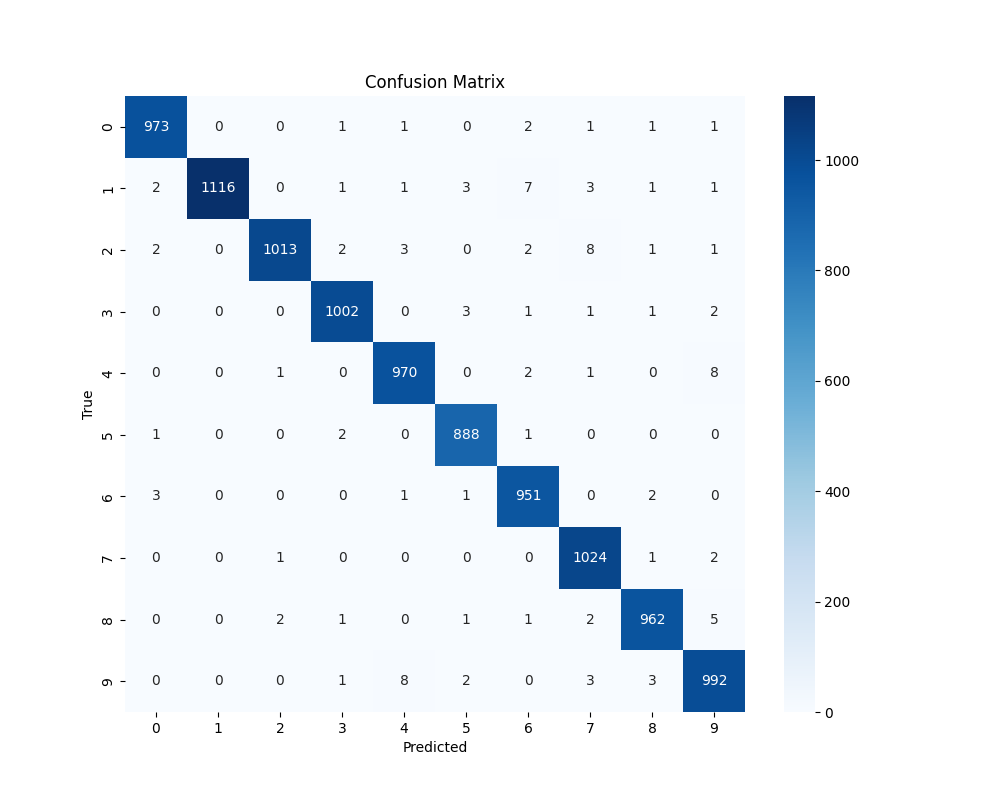

# MNIST Digit Classification Problem
**By Bruno Moreira** 
Consider this my 'hello world!' of PyTorch.

## What we have
A split training/testing dataset of 60 000/10 000 images of handwritten arabic numerals, in 28x28 format, 0-255 values. Two tensors, shapes (60 000, 28, 28) and (10 000, 28, 28). 

## What we want
A reliable way to classify each one of these digits. I used some PyTorch preprocessing with a transformer and a PyTorch CNN.

## How I did it
Extracted idx2 into NumPy arrays, created the appropriate PyTorch Dataset class to handle them into tensors, transformed the data into z-normalized values, loaded it, defined the model, and trained it. 

## The model
To classify the digits, I designed a lightweight convolutional neural network (CNN) using PyTorch. The model takes grayscale 28×28 images as input and passes them through two convolutional layers, each followed by a ReLU activation and max pooling. This extracts spatial features while progressively reducing dimensionality. The output is then flattened and passed through two fully connected (linear) layers, ending in a 10-dimensional output corresponding to the digit classes (0–9). The architecture is intentionally simple and compact, enabling fast training while achieving solid performance on the MNIST dataset. A 2021 MacBook Pro was able to achieve a fast training time over 32 epochs (while I didn't count, it must've been less than 15 mins).

## Results
### Classification Report (Per Class):

              precision    recall  f1-score   support
           0     0.9918    0.9929    0.9924       980
           1     1.0000    0.9833    0.9916      1135
           2     0.9961    0.9816    0.9888      1032
           3     0.9921    0.9921    0.9921      1010
           4     0.9858    0.9878    0.9868       982
           5     0.9889    0.9955    0.9922       892
           6     0.9835    0.9927    0.9881       958
           7     0.9818    0.9961    0.9889      1028
           8     0.9897    0.9877    0.9887       974
           9     0.9802    0.9832    0.9817      1009

### Confusion Matrix

## How to run
The command `python3 reader.py` reads and evaluates a model, either a saved one under `digit_cnn.pth` or, if not found, it runs a new one from scratch and saves it.